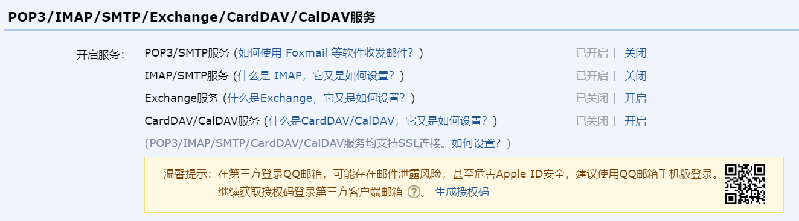
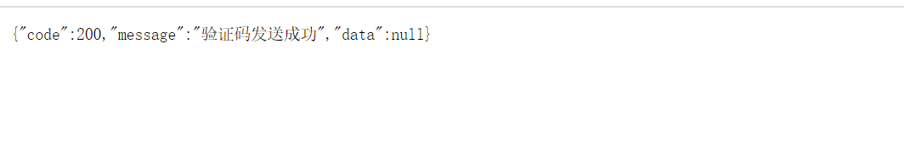
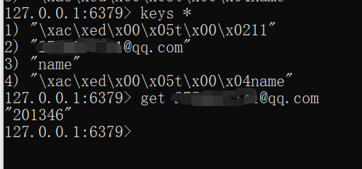

# 一 为什么用Redis缓存验证码

1. redis缓存运行效率高
2. redis可以通过expire来设定过期策略，比较适用于验证码的场景。
3. 考虑到分布式数据个负载均衡数据要一致，这种共有的不用持久化的数据最好找一个缓存服务器存储
4. redis、Memcache都是内存数据库，都支持K-Y型的数据结构
5. redis还支持其他更加丰富的数据结构（list，set，hash等）

# 二 开启POP3/SMTP服务

## 2.1 在QQ邮箱的【设置】=>【账户】里开启POP3/SMTP服务。



保存生成的授权码

# 三 添加依赖和配置application.yml

## 3.1 pom.xml文件添加

```xml
<dependencies>
    
        <!-- redis依赖-->
        <dependency>
            <groupId>org.springframework.boot</groupId>
            <artifactId>spring-boot-starter-data-redis</artifactId>
        </dependency>
        <!--集成邮箱-->
        <dependency>
            <groupId>org.springframework.boot</groupId>
            <artifactId>spring-boot-starter-mail</artifactId>
            <version>2.6.4</version>
        </dependency>
    
</dependencies>
```

## 3.2 配置application.yml文件

```yml
server:
  # 服务端口
  port: 8204
Spring:
  redis:
    # 改成自己redis的ip地址
    host: localhost
    port: 6379
    database: 0
    timeout: 1800000
    lettuce:
      pool:
        # 最大阻塞等待时间(负数表示没限制)
        max-active: 20
        max-wait: -1
  mail:
    # 配置QQ邮件信息
    host: smtp.qq.com
    # 发送邮件者信箱
    username: xxxxx@qq.com
    # IMAP/SMTP服务时邮箱的密文授权码（之前保存的）
    password: xxxxxxxxx
    default-encoding: UTF-8
    port: 465
    properties:
      mail:
        debug: true
        smtp:
          socketFactory:
            class: javax.net.ssl.SSLSocketFactory
```

# 四 配置启动类和工具类

## 4.1 配置启动类EmailcodeApplication

```java
//取消数据源自动配置
@SpringBootApplication(exclude = DataSourceAutoConfiguration.class)
public class EmailcodeApplication {
    
    public static void main(String[] args) {
        SpringApplication.run(EmailcodeApplication.class, args);
    }

}
```


## 4.2 创建工具类RandomUtil，生成验证码

```java
package com.wyq.emailcode.util;

import java.text.DecimalFormat;
import java.util.ArrayList;
import java.util.HashMap;
import java.util.List;
import java.util.Random;

/**
 * @ClassName RandomUtil
 * @Description: //TODO 生成随机验证码
 * @Author wyq
 * @Date 2022/4/18 21:38
 */
public class RandomUtil {

    private static final Random random = new Random();
    private static final DecimalFormat fourdf = new DecimalFormat("0000");//4位验证码
    private static final DecimalFormat sixdf = new DecimalFormat("000000");//6位验证码

    public static String getFourBitRandom() {
        return fourdf.format(random.nextInt(10000));
    }

    public static String getSixBitRandom() {
        return sixdf.format(random.nextInt(1000000));
    }

    // 给定数组，抽取n个数据
    public static ArrayList getRandom(List list, int n) {
        Random random = new Random();
        HashMap<Object, Object> hashMap = new HashMap<Object, Object>();

        // 生成随机数字并存入HashMap
        for (int i = 0; i < list.size(); i++) {

            int number = random.nextInt(100) + 1;

            hashMap.put(number, i);
        }

        // 从HashMap导入数组
        Object[] robjs = hashMap.values().toArray();
        ArrayList r = new ArrayList();

        // 遍历数组并打印数据
        for (int i = 0; i < n; i++) {
            r.add(list.get((int) robjs[i]));
            System.out.print(list.get((int) robjs[i]) + "\t");
        }
        System.out.print("\n");
        return r;
    }
}
```

## 4.3 创建RedisConfig，配置Redis设置

```java
package com.wyq.emailcode.config;

import com.fasterxml.jackson.annotation.JsonAutoDetect;
import com.fasterxml.jackson.annotation.PropertyAccessor;
import com.fasterxml.jackson.databind.ObjectMapper;
import com.fasterxml.jackson.databind.jsontype.impl.LaissezFaireSubTypeValidator;
import org.springframework.context.annotation.Bean;
import org.springframework.context.annotation.Configuration;
import org.springframework.data.redis.connection.RedisConnectionFactory;
import org.springframework.data.redis.core.RedisTemplate;
import org.springframework.data.redis.serializer.Jackson2JsonRedisSerializer;
import org.springframework.data.redis.serializer.StringRedisSerializer;

/**
 * @ClassName RedisConfig
 * @Description: //TODO Redis配置类
 * @Author wyq
 * @Date 2022/4/18 21:02
 */
@Configuration
public class RedisConfig {
    // 把这个bean的name设置为redisTemplate，这样我们才能全面接管redisTemplate！
    @Bean(name = "redisTemplate")
    public RedisTemplate<String, Object> redisTemplate(RedisConnectionFactory redisConnectionFactory) {
        RedisTemplate<String, Object> template = new RedisTemplate<>();
        template.setConnectionFactory(redisConnectionFactory);
        // jackson序列化所有的类
        Jackson2JsonRedisSerializer Jackson2JsonRedisSerializer = new Jackson2JsonRedisSerializer(Object.class);
        // jackson序列化的一些配置
        ObjectMapper om = new ObjectMapper();
        om.setVisibility(PropertyAccessor.ALL, JsonAutoDetect.Visibility.ANY);
        om.activateDefaultTyping(LaissezFaireSubTypeValidator.instance);
        Jackson2JsonRedisSerializer.setObjectMapper(om);
        // String的序列化
        StringRedisSerializer stringSerializer = new StringRedisSerializer();

        //将我们的key采用String的序列化方式
        template.setKeySerializer(stringSerializer);
        //将我们的hash的key也采用String的序列化方式
        template.setHashKeySerializer(stringSerializer);
        //value采用jackson序列化方式
        template.setValueSerializer(Jackson2JsonRedisSerializer);
        //hash的value也采用jackson序列化方式
        template.setHashValueSerializer(Jackson2JsonRedisSerializer);

        template.afterPropertiesSet();


        return template;
    }
}

```

# 五 创建控制层和业务层

## 5.1 创建控制层MailController

```java
package com.wyq.emailcode.controller;

import com.wyq.emailcode.common.ResultJson;
import com.wyq.emailcode.service.MailService;
import com.wyq.emailcode.util.RandomUtil;
import org.springframework.beans.factory.annotation.Autowired;
import org.springframework.data.redis.core.RedisTemplate;
import org.springframework.util.StringUtils;
import org.springframework.web.bind.annotation.GetMapping;
import org.springframework.web.bind.annotation.PathVariable;
import org.springframework.web.bind.annotation.RequestMapping;
import org.springframework.web.bind.annotation.RestController;


import java.util.concurrent.TimeUnit;

/**
 * @ClassName MailController
 * @Description: //TODO 邮件
 * @Author wyq
 * @Date 2022/4/18 21:47
 */
@RestController
@RequestMapping("api/email")
public class MailController {
    @Autowired
    private MailService mailService;

    @Autowired
    private RedisTemplate<String, String> redisTemplate;

    //发送邮箱验证码
    @GetMapping("send/{email}")
    public ResultJson sendEmail(@PathVariable String email) {
        //key 邮箱号  value 验证码
        String code = redisTemplate.opsForValue().get(email);
        //从redis获取验证码，如果获取获取到，返回ok
        if (!StringUtils.isEmpty(code)) {
            return ResultJson.success();
        }
        //如果从redis获取不到，生成新的6位验证码
        code = RandomUtil.getSixBitRandom();
        //调用service方法，通过邮箱服务进行发送
        boolean isSend = mailService.sendMail(email, code);
        //生成验证码放到redis里面，设置有效时间为5分钟
        if (isSend) {
            redisTemplate.opsForValue().set(email, code, 5, TimeUnit.MINUTES);
            return ResultJson.success();
        } else {
            return ResultJson.error();
        }
    }
}
```

## 5.2 创建业务层MailService和MailServiceImpl 

```java
package com.wyq.emailcode.service;

/**
 * @ClassName MailService
 * @Description: //TODO
 * @Author wyq
 * @Date 2022/4/18 21:50
 */
public interface MailService {
    //发送邮件
    boolean sendMail(String email, String text);
}
```

```java
package com.wyq.emailcode.serviceimpl;

import com.wyq.emailcode.service.MailService;

import org.springframework.beans.factory.annotation.Autowired;
import org.springframework.beans.factory.annotation.Value;
import org.springframework.mail.MailException;
import org.springframework.mail.SimpleMailMessage;
import org.springframework.mail.javamail.JavaMailSender;
import org.springframework.stereotype.Service;
import org.springframework.util.StringUtils;

/**
 * @ClassName MailServiceImpl
 * @Description: //TODO
 * @Author wyq
 * @Date 2022/4/18 21:50
 */
@Service
public class MailServiceImpl implements MailService {

    @Value("${spring.mail.username}")
    private String UserName;//获得配置文件中的username

    @Autowired
    private JavaMailSender mailSender;//注入发送邮件的bean

    @Override
    public boolean sendMail(String email, String code) {
        //判断邮箱是否为空
        if (StringUtils.isEmpty(email)) {
            return false;
        }
        //标题
        String subject = "邮箱验证码";
        //正文内容
        String text = "你的验证码为" + code + "，有效时间为5分钟，请尽快使用并且不要告诉别人。";

        SimpleMailMessage msg = new SimpleMailMessage();
        //发送邮件的邮箱
        msg.setFrom(UserName);
        //发送到哪(邮箱)
        msg.setTo(email);
        //邮箱标题
        msg.setSubject(subject);
        //邮箱文本
        msg.setText(text);
        try {
            mailSender.send(msg);
            System.out.println("msg=====>" + msg);
        } catch (MailException ex) {
            ex.getMessage();
        }
        return true;
    }
}
```

# 六 测试

## 6.1 访问url

http://localhost:8204/api/email/send/xxxxxx@qq.com

## 6.2 前端返回



## 6.3 邮箱接收


## 6.4 cmd查看Redis


